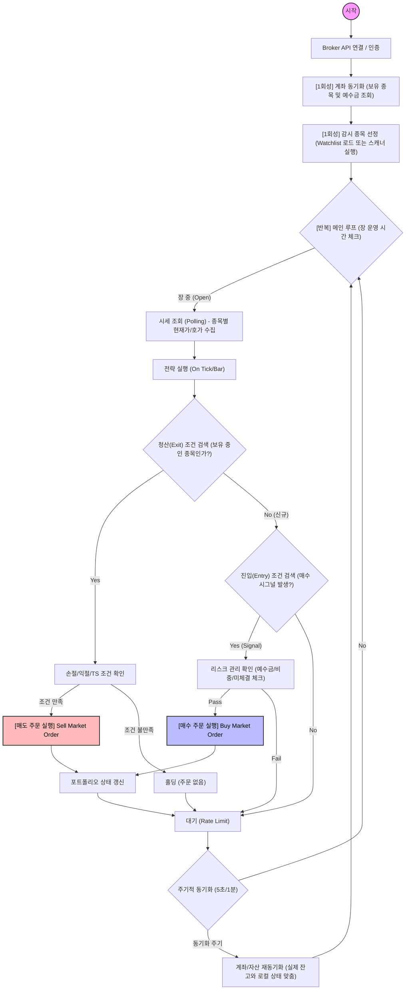

# 핵심 매매 로직 타이밍 차트 (Core Trading Flow)

현재 소스코드(`engine.py`, `market_data.py`, `strategies/*.py`)를 분석하여 매매에 직접적인 영향을 주는 핵심 액션들의 순서를 정리했습니다.

> **범례**
> - `[1회성]` : 프로그램 시작 시 또는 특정 조건에서만 실행
> - `[반복]` : 장 중 계속해서 실행되는 루프

---

## 단계별 핵심 액션 상세

### 1. 전처리 (Preprocessing) - [1회성]
시스템 시작 시 매매를 준비하는 단계입니다.
1.  **Broker 접속**: API 토큰 발행 및 접속 확인.
2.  **계좌 동기화 (Portfolio Sync)**: 현재 증권사 계좌의 **실제 보유주식(수량, 평단가)**과 **예수금**을 가져와 메모리에 로드합니다. (이 정보가 없으면 매도 판단을 할 수 없습니다.)
3.  **감시 유니버스 구성**: 어떤 종목을 매매할지(`watchlist`) 결정합니다. DB에서 불러오거나, 조건검색(Scanner)을 통해 대상을 추립니다.

### 2. 전략 실행 (Execution Loop) - [반복]
실시간으로 반복되며 매매 판단을 내리는 핵심 구간입니다.
1.  **시세 수집 (Market Data)**: 감시 종목들의 현재가(Tick)를 가져옵니다.
2.  **보유 종목 청산 판단 (Exit - 우선순위 高)**:
    *   `RiskManager`나 `Strategy` 내부에서 먼저 현재 보유 중인 종목의 수행 여부를 판단합니다.
    *   **액션**: 손절가(StopLoss), 목표가(TakeProfit), 트레일링스탑 조건에 해당하면 즉시 **시장가 매도**를 실행합니다.
3.  **신규 종목 진입 판단 (Entry)**:
    *   보유하지 않은 종목 중 기술적 지표(이평선, 거래량 등)가 진입 조건을 만족하는지 확인합니다.
    *   **액션**: 리스크(RiskManager)를 통과하면 **시장가 매수**를 실행합니다.

### 3. 후처리 및 상태관리 - [주기적 반복]
매매 주문 후 혹은 일정 주기마다 데이터 정합성을 맞춥니다.
1.  **포트폴리오 갱신**: 주문 체결 정보를 반영하여 잔고를 업데이트합니다.
2.  **재동기화 (Re-Sync)**: 주문 누락이나 체결 불일치를 방지하기 위해 5초~1분 단위로 증권사 실제 잔고를 다시 조회하여 강제로 맞춥니다.
3.  **감시 종목 리밸런싱**: (옵션) 일정 시간마다 조건검색을 다시 돌려 감시 대상을 교체합니다.
