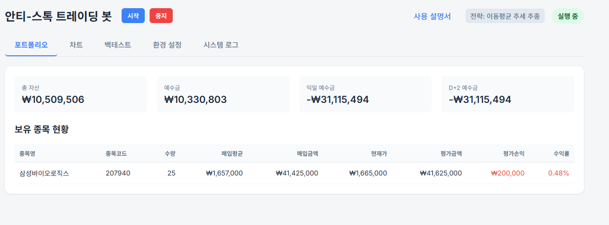
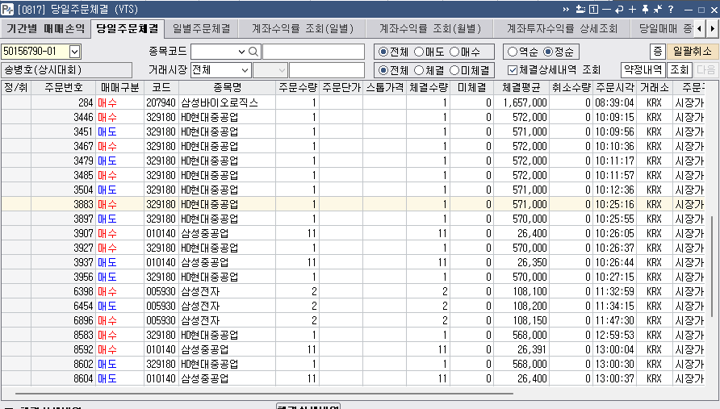

1. 미수금 발생 문제
 - 아래 이미지처럼 D+2 예수금이 마이너스가 되도록 매수가 이루어지는 문제 발생함. 이는 예상치 못한 반대매매를 발생시킬 위험이 있음
 - 이미지에서 보듯이 현재 보유종목의 매입금액이 총자산 10,509,506원보다 훨씬 큰 41,425,000원으로 되어 있음
 - D+2 예수금이 마이너스가 되지 않도록 가용 예수금을 계산하면서 다음 주문을 넣어야 함
 - 가용 예수금은 현금 비중을 유지하기 위한 계산 예수금[예수금 - (총 자산 X 현금비중)]이며 0 보다 큰 값일 때만 주문이 가능함
 - 현금 비중은 전략 공통 설정에 추가 관리할 수 있도록 항목을 추가해야 함
 

2. 거래시간 미준수 문제
 - 아래 anti_stock.log 파일 내용 일부를 발췌했는데, 거래시간(KRX: 09:00 ~ 15:30, NXT: 08:00 ~ 20:00)을 준수하지 않음
 - 거래시간에 해당하지 않는 경우는 Auto-Scanner running... Mode 가 반복되면 안됨 (engine.py 파일의 Inner Loop 부분)

2025-12-10 00:24:26,475 - __main__ - INFO - Starting Anti-Stock Trading System...
2025-12-10 00:24:26,482 - core.engine - INFO - Authenticating for paper (vps)
2025-12-10 00:24:26,489 - core.kis_api - INFO - [RateLimiter] Auth completed. Timestamp updated to 1765293866.4889884
2025-12-10 00:24:26,778 - core.market_data - INFO - Loaded Master Files: KOSPI(2492), KOSDAQ(1815)
2025-12-10 00:24:26,789 - __main__ - INFO - Web Interface started at http://localhost:8000
2025-12-10 00:24:26,789 - core.engine - INFO - Engine loop started
2025-12-10 00:24:26,789 - core.engine - INFO - Active strategy ID: ma_trend
2025-12-10 00:24:26,789 - core.engine - INFO - Initialized active strategy: ma_trend
2025-12-10 00:24:27,208 - core.engine - INFO - Fetching Watchlist (Group 000) for caching...
2025-12-10 00:24:27,814 - core.scanner - INFO - Fetching watchlist group: 자동매매 (000)
2025-12-10 00:24:28,493 - core.engine - INFO - Cached Watchlist: 29 stocks
2025-12-10 00:24:28,494 - core.engine - INFO - Auto-Scanner running... Mode: volume
2025-12-10 00:24:29,107 - core.engine - INFO - Scanner found 22 stocks: ['005930', '000660', '0126Z0', '950250', '086520', '098460', '466100', '247540', '005380', '004310', '290650', '010140', '012450', '034020', '457190', '329180', '0009K0', '007660', '196170', '347850', '108490', '064350']
2025-12-10 00:24:29,107 - core.engine - INFO - Filtered by Watchlist (API+Manual): 9 stocks selected ['005930', '000660', '005380', '010140', '012450', '034020', '329180', '196170', '064350']
2025-12-10 00:24:29,107 - core.market_data - INFO - Updated polling list: 9 symbols
2025-12-10 00:24:29,107 - core.engine - INFO - [감시 종목 업데이트] 총 9개: 012450, 000660, 005930, 064350, 005380, 329180, 034020, 010140, 196170
2025-12-10 00:24:29,108 - core.market_data - INFO - Market Data Polling Started
2025-12-10 00:24:31,736 - MovingAverageTrendStrategy - INFO - [감시 중] 012450 한화에어로스페이스 | 현재가: 937,000 | 이평돌파: 937,000 ≥ 937,100(대기) | 거래량비: 15.2 ≥ 1.5(충족)
2025-12-10 00:24:33,648 - MovingAverageTrendStrategy - INFO - [감시 제외] 000660 SK하이닉스 | 사유: 하락 추세 (현재 566,000 < MA20 556,650)
2025-12-10 00:24:35,534 - MovingAverageTrendStrategy - INFO - [감시 중] 005930 삼성전자 | 현재가: 109,500 | 이평돌파: 109,420 ≥ 109,220(충족) | 거래량비: 14.8 ≥ 1.5(충족)
2025-12-10 00:24:38,107 - MovingAverageTrendStrategy - INFO - [감시 제외] 064350 현대로템 | 사유: 하락 추세 (현재 192,200 < MA20 183,765)
2025-12-10 00:24:40,019 - MovingAverageTrendStrategy - INFO - [감시 중] 005380 현대차 | 현재가: 315,500 | 이평돌파: 315,100 ≥ 314,950(충족) | 거래량비: 14.3 ≥ 1.5(충족)
2025-12-10 00:24:42,595 - MovingAverageTrendStrategy - INFO - [감시 중] 329180 HD현대중공업 | 현재가: 543,000 | 이평돌파: 542,200 ≥ 541,250(충족) | 거래량비: 11.0 ≥ 1.5(충족)
2025-12-10 00:24:44,435 - MovingAverageTrendStrategy - INFO - [감시 제외] 034020 두산에너빌리티 | 사유: 하락 추세 (현재 76,700 < MA20 76,920)
2025-12-10 00:24:46,328 - MovingAverageTrendStrategy - INFO - [감시 중] 010140 삼성중공업 | 현재가: 25,900 | 이평돌파: 25,860 ≥ 25,825(충족) | 거래량비: 12.4 ≥ 1.5(충족)
2025-12-10 00:24:48,971 - MovingAverageTrendStrategy - INFO - [감시 제외] 196170 알테오젠 | 사유: 하락 추세 (현재 457,000 < MA20 524,575)
2025-12-10 00:24:50,194 - MovingAverageTrendStrategy - INFO - [감시 중] 012450 한화에어로스페이스 | 현재가: 937,000 | 이평돌파: 937,000 ≥ 937,100(대기) | 거래량비: 15.2 ≥ 1.5(충족)
2025-12-10 00:24:51,448 - MovingAverageTrendStrategy - INFO - [감시 제외] 000660 SK하이닉스 | 사유: 하락 추세 (현재 566,000 < MA20 556,650)
2025-12-10 00:24:52,702 - MovingAverageTrendStrategy - INFO - [감시 중] 005930 삼성전자 | 현재가: 109,500 | 이평돌파: 109,420 ≥ 109,220(충족) | 거래량비: 14.8 ≥ 1.5(충족)
2025-12-10 00:24:53,922 - MovingAverageTrendStrategy - INFO - [감시 제외] 064350 현대로템 | 사유: 하락 추세 (현재 192,200 < MA20 183,765)
2025-12-10 00:24:55,818 - MovingAverageTrendStrategy - INFO - [감시 중] 005380 현대차 | 현재가: 315,500 | 이평돌파: 315,100 ≥ 314,950(충족) | 거래량비: 14.3 ≥ 1.5(충족)
2025-12-10 00:24:57,045 - MovingAverageTrendStrategy - INFO - [감시 중] 329180 HD현대중공업 | 현재가: 543,000 | 이평돌파: 542,200 ≥ 541,250(충족) | 거래량비: 11.0 ≥ 1.5(충족)
2025-12-10 00:24:58,297 - MovingAverageTrendStrategy - INFO - [감시 제외] 034020 두산에너빌리티 | 사유: 하락 추세 (현재 76,700 < MA20 76,920)
2025-12-10 00:24:59,557 - MovingAverageTrendStrategy - INFO - [감시 중] 010140 삼성중공업 | 현재가: 25,900 | 이평돌파: 25,860 ≥ 25,825(충족) | 거래량비: 12.4 ≥ 1.5(충족)
2025-12-10 00:25:01,454 - MovingAverageTrendStrategy - INFO - [감시 제외] 196170 알테오젠 | 사유: 하락 추세 (현재 457,000 < MA20 524,575)
2025-12-10 00:25:02,684 - MovingAverageTrendStrategy - INFO - [감시 중] 012450 한화에어로스페이스 | 현재가: 937,000 | 이평돌파: 937,000 ≥ 937,100(대기) | 거래량비: 15.2 ≥ 1.5(충족)
2025-12-10 00:25:03,900 - MovingAverageTrendStrategy - INFO - [감시 제외] 000660 SK하이닉스 | 사유: 하락 추세 (현재 566,000 < MA20 556,650)
2025-12-10 00:25:05,174 - MovingAverageTrendStrategy - INFO - [감시 중] 005930 삼성전자 | 현재가: 109,500 | 이평돌파: 109,420 ≥ 109,220(충족) | 거래량비: 14.8 ≥ 1.5(충족)
2025-12-10 00:25:07,124 - MovingAverageTrendStrategy - INFO - [감시 제외] 064350 현대로템 | 사유: 하락 추세 (현재 192,200 < MA20 183,765)
2025-12-10 00:25:08,435 - MovingAverageTrendStrategy - INFO - [감시 중] 005380 현대차 | 현재가: 315,500 | 이평돌파: 315,100 ≥ 314,950(충족) | 거래량비: 14.3 ≥ 1.5(충족)
2025-12-10 00:25:09,692 - MovingAverageTrendStrategy - INFO - [감시 중] 329180 HD현대중공업 | 현재가: 543,000 | 이평돌파: 542,200 ≥ 541,250(충족) | 거래량비: 11.0 ≥ 1.5(충족)
2025-12-10 00:25:10,898 - MovingAverageTrendStrategy - INFO - [감시 제외] 034020 두산에너빌리티 | 사유: 하락 추세 (현재 76,700 < MA20 76,920)
2025-12-10 00:25:12,101 - MovingAverageTrendStrategy - INFO - [감시 중] 010140 삼성중공업 | 현재가: 25,900 | 이평돌파: 25,860 ≥ 25,825(충족) | 거래량비: 12.4 ≥ 1.5(충족)
2025-12-10 00:25:14,047 - MovingAverageTrendStrategy - INFO - [감시 제외] 196170 알테오젠 | 사유: 하락 추세 (현재 457,000 < MA20 524,575)
2025-12-10 00:25:15,376 - MovingAverageTrendStrategy - INFO - [감시 중] 012450 한화에어로스페이스 | 현재가: 937,000 | 이평돌파: 937,000 ≥ 937,100(대기) | 거래량비: 15.2 ≥ 1.5(충족)
2025-12-10 00:25:16,595 - MovingAverageTrendStrategy - INFO - [감시 제외] 000660 SK하이닉스 | 사유: 하락 추세 (현재 566,000 < MA20 556,650)
2025-12-10 00:25:17,882 - MovingAverageTrendStrategy - INFO - [감시 중] 005930 삼성전자 | 현재가: 109,500 | 이평돌파: 109,420 ≥ 109,220(충족) | 거래량비: 14.8 ≥ 1.5(충족)
2025-12-10 00:25:19,763 - MovingAverageTrendStrategy - INFO - [감시 제외] 064350 현대로템 | 사유: 하락 추세 (현재 192,200 < MA20 183,765)
2025-12-10 00:25:21,025 - MovingAverageTrendStrategy - INFO - [감시 중] 005380 현대차 | 현재가: 315,500 | 이평돌파: 315,100 ≥ 314,950(충족) | 거래량비: 14.3 ≥ 1.5(충족)
2025-12-10 00:25:22,218 - MovingAverageTrendStrategy - INFO - [감시 중] 329180 HD현대중공업 | 현재가: 543,000 | 이평돌파: 542,200 ≥ 541,250(충족) | 거래량비: 11.0 ≥ 1.5(충족)
2025-12-10 00:25:23,450 - MovingAverageTrendStrategy - INFO - [감시 제외] 034020 두산에너빌리티 | 사유: 하락 추세 (현재 76,700 < MA20 76,920)
2025-12-10 00:25:24,696 - MovingAverageTrendStrategy - INFO - [감시 중] 010140 삼성중공업 | 현재가: 25,900 | 이평돌파: 25,860 ≥ 25,825(충족) | 거래량비: 12.4 ≥ 1.5(충족)
2025-12-10 00:25:26,579 - MovingAverageTrendStrategy - INFO - [감시 제외] 196170 알테오젠 | 사유: 하락 추세 (현재 457,000 < MA20 524,575)
2025-12-10 00:25:27,821 - MovingAverageTrendStrategy - INFO - [감시 중] 012450 한화에어로스페이스 | 현재가: 937,000 | 이평돌파: 937,000 ≥ 937,100(대기) | 거래량비: 15.2 ≥ 1.5(충족)
2025-12-10 00:25:29,097 - MovingAverageTrendStrategy - INFO - [감시 제외] 000660 SK하이닉스 | 사유: 하락 추세 (현재 566,000 < MA20 556,650)
2025-12-10 00:25:29,357 - core.engine - INFO - Auto-Scanner running... Mode: volume
2025-12-10 00:25:30,391 - core.engine - INFO - Scanner found 22 stocks: ['005930', '000660', '0126Z0', '950250', '086520', '098460', '466100', '247540', '005380', '004310', '290650', '010140', '012450', '034020', '457190', '329180', '0009K0', '007660', '196170', '347850', '108490', '064350']
2025-12-10 00:25:30,392 - core.engine - INFO - Filtered by Watchlist (API+Manual): 9 stocks selected ['005930', '000660', '005380', '010140', '012450', '034020', '329180', '196170', '064350']
2025-12-10 00:25:30,393 - core.market_data - INFO - Updated polling list: 9 symbols
2025-12-10 00:25:30,393 - core.engine - INFO - [감시 종목 업데이트] 총 9개: 012450, 000660, 005930, 064350, 005380, 329180, 034020, 010140, 196170
2025-12-10 00:25:31,008 - MovingAverageTrendStrategy - INFO - [감시 중] 005930 삼성전자 | 현재가: 109,500 | 이평돌파: 109,420 ≥ 109,220(충족) | 거래량비: 14.8 ≥ 1.5(충족)
2025-12-10 00:25:32,901 - MovingAverageTrendStrategy - INFO - [감시 제외] 064350 현대로템 | 사유: 하락 추세 (현재 192,200 < MA20 183,765)
2025-12-10 00:25:34,126 - MovingAverageTrendStrategy - INFO - [감시 중] 005380 현대차 | 현재가: 315,500 | 이평돌파: 315,100 ≥ 314,950(충족) | 거래량비: 14.3 ≥ 1.5(충족)
2025-12-10 00:25:35,367 - MovingAverageTrendStrategy - INFO - [감시 중] 329180 HD현대중공업 | 현재가: 543,000 | 이평돌파: 542,200 ≥ 541,250(충족) | 거래량비: 11.0 ≥ 1.5(충족)
2025-12-10 00:25:36,571 - MovingAverageTrendStrategy - INFO - [감시 제외] 034020 두산에너빌리티 | 사유: 하락 추세 (현재 76,700 < MA20 76,920)
2025-12-10 00:25:38,525 - MovingAverageTrendStrategy - INFO - [감시 중] 010140 삼성중공업 | 현재가: 25,900 | 이평돌파: 25,860 ≥ 25,825(충족) | 거래량비: 12.4 ≥ 1.5(충족)
2025-12-10 00:25:39,759 - MovingAverageTrendStrategy - INFO - [감시 제외] 196170 알테오젠 | 사유: 하락 추세 (현재 457,000 < MA20 524,575)
2025-12-10 00:25:41,623 - MovingAverageTrendStrategy - INFO - [감시 중] 012450 한화에어로스페이스 | 현재가: 937,000 | 이평돌파: 937,000 ≥ 937,100(대기) | 거래량비: 15.2 ≥ 1.5(충족)
2025-12-10 00:25:43,499 - MovingAverageTrendStrategy - INFO - [감시 제외] 000660 SK하이닉스 | 사유: 하락 추세 (현재 566,000 < MA20 556,650)
2025-12-10 00:25:45,992 - MovingAverageTrendStrategy - INFO - [감시 중] 005930 삼성전자 | 현재가: 109,500 | 이평돌파: 109,420 ≥ 109,220(충족) | 거래량비: 14.8 ≥ 1.5(충족)
2025-12-10 00:25:47,860 - MovingAverageTrendStrategy - INFO - [감시 제외] 064350 현대로템 | 사유: 하락 추세 (현재 192,200 < MA20 183,765)
2025-12-10 00:25:49,720 - MovingAverageTrendStrategy - INFO - [감시 중] 005380 현대차 | 현재가: 315,500 | 이평돌파: 315,100 ≥ 314,950(충족) | 거래량비: 14.3 ≥ 1.5(충족)
2025-12-10 00:25:52,237 - MovingAverageTrendStrategy - INFO - [감시 중] 329180 HD현대중공업 | 현재가: 543,000 | 이평돌파: 542,200 ≥ 541,250(충족) | 거래량비: 11.0 ≥ 1.5(충족)
2025-12-10 00:25:54,110 - MovingAverageTrendStrategy - INFO - [감시 제외] 034020 두산에너빌리티 | 사유: 하락 추세 (현재 76,700 < MA20 76,920)
2025-12-10 00:25:56,027 - MovingAverageTrendStrategy - INFO - [감시 중] 010140 삼성중공업 | 현재가: 25,900 | 이평돌파: 25,860 ≥ 25,825(충족) | 거래량비: 12.4 ≥ 1.5(충족)
2025-12-10 00:25:58,590 - MovingAverageTrendStrategy - INFO - [감시 제외] 196170 알테오젠 | 사유: 하락 추세 (현재 457,000 < MA20 524,575)
2025-12-10 00:25:59,834 - MovingAverageTrendStrategy - INFO - [감시 중] 012450 한화에어로스페이스 | 현재가: 937,000 | 이평돌파: 937,000 ≥ 937,100(대기) | 거래량비: 15.2 ≥ 1.5(충족)
2025-12-10 00:26:01,182 - MovingAverageTrendStrategy - INFO - [감시 제외] 000660 SK하이닉스 | 사유: 하락 추세 (현재 566,000 < MA20 556,650)
2025-12-10 00:26:03,180 - MovingAverageTrendStrategy - INFO - [감시 중] 005930 삼성전자 | 현재가: 109,500 | 이평돌파: 109,420 ≥ 109,220(충족) | 거래량비: 14.8 ≥ 1.5(충족)
2025-12-10 00:26:04,323 - MovingAverageTrendStrategy - INFO - [감시 제외] 064350 현대로템 | 사유: 하락 추세 (현재 192,200 < MA20 183,765)
2025-12-10 00:26:05,582 - MovingAverageTrendStrategy - INFO - [감시 중] 005380 현대차 | 현재가: 315,500 | 이평돌파: 315,100 ≥ 314,950(충족) | 거래량비: 14.3 ≥ 1.5(충족)
2025-12-10 00:26:06,802 - MovingAverageTrendStrategy - INFO - [감시 중] 329180 HD현대중공업 | 현재가: 543,000 | 이평돌파: 542,200 ≥ 541,250(충족) | 거래량비: 11.0 ≥ 1.5(충족)
2025-12-10 00:26:08,058 - MovingAverageTrendStrategy - INFO - [감시 제외] 034020 두산에너빌리티 | 사유: 하락 추세 (현재 76,700 < MA20 76,920)
2025-12-10 00:26:10,005 - MovingAverageTrendStrategy - INFO - [감시 중] 010140 삼성중공업 | 현재가: 25,900 | 이평돌파: 25,860 ≥ 25,825(충족) | 거래량비: 12.4 ≥ 1.5(충족)
2025-12-10 00:26:11,548 - MovingAverageTrendStrategy - INFO - [감시 제외] 196170 알테오젠 | 사유: 하락 추세 (현재 457,000 < MA20 524,575)
2025-12-10 00:26:12,788 - MovingAverageTrendStrategy - INFO - [감시 중] 012450 한화에어로스페이스 | 현재가: 937,000 | 이평돌파: 937,000 ≥ 937,100(대기) | 거래량비: 15.2 ≥ 1.5(충족)
2025-12-10 00:26:14,023 - MovingAverageTrendStrategy - INFO - [감시 제외] 000660 SK하이닉스 | 사유: 하락 추세 (현재 566,000 < MA20 556,650)
2025-12-10 00:26:15,996 - MovingAverageTrendStrategy - INFO - [감시 중] 005930 삼성전자 | 현재가: 109,500 | 이평돌파: 109,420 ≥ 109,220(충족) | 거래량비: 14.8 ≥ 1.5(충족)
2025-12-10 00:26:17,217 - MovingAverageTrendStrategy - INFO - [감시 제외] 064350 현대로템 | 사유: 하락 추세 (현재 192,200 < MA20 183,765)
2025-12-10 00:26:18,479 - MovingAverageTrendStrategy - INFO - [감시 중] 005380 현대차 | 현재가: 315,500 | 이평돌파: 315,100 ≥ 314,950(충족) | 거래량비: 14.3 ≥ 1.5(충족)
2025-12-10 00:26:19,718 - MovingAverageTrendStrategy - INFO - [감시 중] 329180 HD현대중공업 | 현재가: 543,000 | 이평돌파: 542,200 ≥ 541,250(충족) | 거래량비: 11.0 ≥ 1.5(충족)
2025-12-10 00:26:21,605 - MovingAverageTrendStrategy - INFO - [감시 제외] 034020 두산에너빌리티 | 사유: 하락 추세 (현재 76,700 < MA20 76,920)
2025-12-10 00:26:22,848 - MovingAverageTrendStrategy - INFO - [감시 중] 010140 삼성중공업 | 현재가: 25,900 | 이평돌파: 25,860 ≥ 25,825(충족) | 거래량비: 12.4 ≥ 1.5(충족)
2025-12-10 00:26:24,098 - MovingAverageTrendStrategy - INFO - [감시 제외] 196170 알테오젠 | 사유: 하락 추세 (현재 457,000 < MA20 524,575)
2025-12-10 00:26:25,338 - MovingAverageTrendStrategy - INFO - [감시 중] 012450 한화에어로스페이스 | 현재가: 937,000 | 이평돌파: 937,000 ≥ 937,100(대기) | 거래량비: 15.2 ≥ 1.5(충족)
2025-12-10 00:26:26,584 - MovingAverageTrendStrategy - INFO - [감시 제외] 000660 SK하이닉스 | 사유: 하락 추세 (현재 566,000 < MA20 556,650)
2025-12-10 00:26:28,540 - MovingAverageTrendStrategy - INFO - [감시 중] 005930 삼성전자 | 현재가: 109,500 | 이평돌파: 109,420 ≥ 109,220(충족) | 거래량비: 14.8 ≥ 1.5(충족)
2025-12-10 00:26:29,767 - MovingAverageTrendStrategy - INFO - [감시 제외] 064350 현대로템 | 사유: 하락 추세 (현재 192,200 < MA20 183,765)
2025-12-10 00:26:31,053 - MovingAverageTrendStrategy - INFO - [감시 중] 005380 현대차 | 현재가: 315,500 | 이평돌파: 315,100 ≥ 314,950(충족) | 거래량비: 14.3 ≥ 1.5(충족)
2025-12-10 00:26:31,276 - core.engine - INFO - Auto-Scanner running... Mode: volume
2025-12-10 00:26:32,282 - core.engine - INFO - Scanner found 22 stocks: ['005930', '000660', '0126Z0', '950250', '086520', '098460', '466100', '247540', '005380', '004310', '290650', '010140', '012450', '034020', '457190', '329180', '0009K0', '007660', '196170', '347850', '108490', '064350']
2025-12-10 00:26:32,284 - core.engine - INFO - Filtered by Watchlist (API+Manual): 9 stocks selected ['005930', '000660', '005380', '010140', '012450', '034020', '329180', '196170', '064350']
2025-12-10 00:26:32,284 - core.market_data - INFO - Updated polling list: 9 symbols
2025-12-10 00:26:32,284 - core.engine - INFO - [감시 종목 업데이트] 총 9개: 012450, 000660, 005930, 064350, 005380, 329180, 034020, 010140, 196170
2025-12-10 00:26:32,939 - MovingAverageTrendStrategy - INFO - [감시 중] 329180 HD현대중공업 | 현재가: 543,000 | 이평돌파: 542,200 ≥ 541,250(충족) | 거래량비: 11.0 ≥ 1.5(충족)
2025-12-10 00:26:34,863 - MovingAverageTrendStrategy - INFO - [감시 제외] 034020 두산에너빌리티 | 사유: 하락 추세 (현재 76,700 < MA20 76,920)
2025-12-10 00:26:36,153 - MovingAverageTrendStrategy - INFO - [감시 중] 010140 삼성중공업 | 현재가: 25,900 | 이평돌파: 25,860 ≥ 25,825(충족) | 거래량비: 12.4 ≥ 1.5(충족)
2025-12-10 00:26:37,427 - MovingAverageTrendStrategy - INFO - [감시 제외] 196170 알테오젠 | 사유: 하락 추세 (현재 457,000 < MA20 524,575)
2025-12-10 00:26:38,678 - MovingAverageTrendStrategy - INFO - [감시 중] 012450 한화에어로스페이스 | 현재가: 937,000 | 이평돌파: 937,000 ≥ 937,100(대기) | 거래량비: 15.2 ≥ 1.5(충족)
2025-12-10 00:26:40,615 - MovingAverageTrendStrategy - INFO - [감시 제외] 000660 SK하이닉스 | 사유: 하락 추세 (현재 566,000 < MA20 556,650)
2025-12-10 00:26:41,908 - MovingAverageTrendStrategy - INFO - [감시 중] 005930 삼성전자 | 현재가: 109,500 | 이평돌파: 109,420 ≥ 109,220(충족) | 거래량비: 14.8 ≥ 1.5(충족)
2025-12-10 00:26:43,127 - MovingAverageTrendStrategy - INFO - [감시 제외] 064350 현대로템 | 사유: 하락 추세 (현재 192,200 < MA20 183,765)
2025-12-10 00:26:44,322 - MovingAverageTrendStrategy - INFO - [감시 중] 005380 현대차 | 현재가: 315,500 | 이평돌파: 315,100 ≥ 314,950(충족) | 거래량비: 14.3 ≥ 1.5(충족)
2025-12-10 00:26:46,264 - MovingAverageTrendStrategy - INFO - [감시 중] 329180 HD현대중공업 | 현재가: 543,000 | 이평돌파: 542,200 ≥ 541,250(충족) | 거래량비: 11.0 ≥ 1.5(충족)
2025-12-10 00:26:47,513 - MovingAverageTrendStrategy - INFO - [감시 제외] 034020 두산에너빌리티 | 사유: 하락 추세 (현재 76,700 < MA20 76,920)
2025-12-10 00:26:48,745 - MovingAverageTrendStrategy - INFO - [감시 중] 010140 삼성중공업 | 현재가: 25,900 | 이평돌파: 25,860 ≥ 25,825(충족) | 거래량비: 12.4 ≥ 1.5(충족)
2025-12-10 00:26:49,961 - MovingAverageTrendStrategy - INFO - [감시 제외] 196170 알테오젠 | 사유: 하락 추세 (현재 457,000 < MA20 524,575)
2025-12-10 00:26:52,555 - MovingAverageTrendStrategy - INFO - [감시 중] 012450 한화에어로스페이스 | 현재가: 937,000 | 이평돌파: 937,000 ≥ 937,100(대기) | 거래량비: 15.2 ≥ 1.5(충족)
2025-12-10 00:26:54,417 - MovingAverageTrendStrategy - INFO - [감시 제외] 000660 SK하이닉스 | 사유: 하락 추세 (현재 566,000 < MA20 556,650)
2025-12-10 00:26:56,265 - MovingAverageTrendStrategy - INFO - [감시 중] 005930 삼성전자 | 현재가: 109,500 | 이평돌파: 109,420 ≥ 109,220(충족) | 거래량비: 14.8 ≥ 1.5(충족)
2025-12-10 00:26:58,798 - MovingAverageTrendStrategy - INFO - [감시 제외] 064350 현대로템 | 사유: 하락 추세 (현재 192,200 < MA20 183,765)
2025-12-10 00:27:00,757 - MovingAverageTrendStrategy - INFO - [감시 중] 005380 현대차 | 현재가: 315,500 | 이평돌파: 315,100 ≥ 314,950(충족) | 거래량비: 14.3 ≥ 1.5(충족)
2025-12-10 00:27:02,586 - MovingAverageTrendStrategy - INFO - [감시 중] 329180 HD현대중공업 | 현재가: 543,000 | 이평돌파: 542,200 ≥ 541,250(충족) | 거래량비: 11.0 ≥ 1.5(충족)
2025-12-10 00:27:05,192 - MovingAverageTrendStrategy - INFO - [감시 제외] 034020 두산에너빌리티 | 사유: 하락 추세 (현재 76,700 < MA20 76,920)
2025-12-10 00:27:07,090 - MovingAverageTrendStrategy - INFO - [감시 중] 010140 삼성중공업 | 현재가: 25,900 | 이평돌파: 25,860 ≥ 25,825(충족) | 거래량비: 12.4 ≥ 1.5(충족)
2025-12-10 00:27:08,958 - MovingAverageTrendStrategy - INFO - [감시 제외] 196170 알테오젠 | 사유: 하락 추세 (현재 457,000 < MA20 524,575)
2025-12-10 00:27:10,937 - MovingAverageTrendStrategy - INFO - [감시 중] 012450 한화에어로스페이스 | 현재가: 937,000 | 이평돌파: 937,000 ≥ 937,100(대기) | 거래량비: 15.2 ≥ 1.5(충족)
2025-12-10 00:27:12,158 - MovingAverageTrendStrategy - INFO - [감시 제외] 000660 SK하이닉스 | 사유: 하락 추세 (현재 566,000 < MA20 556,650)
2025-12-10 00:27:13,362 - MovingAverageTrendStrategy - INFO - [감시 중] 005930 삼성전자 | 현재가: 109,500 | 이평돌파: 109,420 ≥ 109,220(충족) | 거래량비: 14.8 ≥ 1.5(충족)
2025-12-10 00:27:14,610 - MovingAverageTrendStrategy - INFO - [감시 제외] 064350 현대로템 | 사유: 하락 추세 (현재 192,200 < MA20 183,765)
2025-12-10 00:27:16,499 - MovingAverageTrendStrategy - INFO - [감시 중] 005380 현대차 | 현재가: 315,500 | 이평돌파: 315,100 ≥ 314,950(충족) | 거래량비: 14.3 ≥ 1.5(충족)
2025-12-10 00:27:17,797 - MovingAverageTrendStrategy - INFO - [감시 중] 329180 HD현대중공업 | 현재가: 543,000 | 이평돌파: 542,200 ≥ 541,250(충족) | 거래량비: 11.0 ≥ 1.5(충족)
2025-12-10 00:27:19,017 - MovingAverageTrendStrategy - INFO - [감시 제외] 034020 두산에너빌리티 | 사유: 하락 추세 (현재 76,700 < MA20 76,920)
2025-12-10 00:27:20,256 - MovingAverageTrendStrategy - INFO - [감시 중] 010140 삼성중공업 | 현재가: 25,900 | 이평돌파: 25,860 ≥ 25,825(충족) | 거래량비: 12.4 ≥ 1.5(충족)
2025-12-10 00:27:21,510 - MovingAverageTrendStrategy - INFO - [감시 제외] 196170 알테오젠 | 사유: 하락 추세 (현재 457,000 < MA20 524,575)
2025-12-10 00:27:23,467 - MovingAverageTrendStrategy - INFO - [감시 중] 012450 한화에어로스페이스 | 현재가: 937,000 | 이평돌파: 937,000 ≥ 937,100(대기) | 거래량비: 15.2 ≥ 1.5(충족)
2025-12-10 00:27:24,665 - MovingAverageTrendStrategy - INFO - [감시 제외] 000660 SK하이닉스 | 사유: 하락 추세 (현재 566,000 < MA20 556,650)
2025-12-10 00:27:25,933 - MovingAverageTrendStrategy - INFO - [감시 중] 005930 삼성전자 | 현재가: 109,500 | 이평돌파: 109,420 ≥ 109,220(충족) | 거래량비: 14.8 ≥ 1.5(충족)
2025-12-10 00:27:27,147 - MovingAverageTrendStrategy - INFO - [감시 제외] 064350 현대로템 | 사유: 하락 추세 (현재 192,200 < MA20 183,765)
2025-12-10 00:27:29,096 - MovingAverageTrendStrategy - INFO - [감시 중] 005380 현대차 | 현재가: 315,500 | 이평돌파: 315,100 ≥ 314,950(충족) | 거래량비: 14.3 ≥ 1.5(충족)
2025-12-10 00:27:30,384 - MovingAverageTrendStrategy - INFO - [감시 중] 329180 HD현대중공업 | 현재가: 543,000 | 이평돌파: 542,200 ≥ 541,250(충족) | 거래량비: 11.0 ≥ 1.5(충족)
2025-12-10 00:27:31,604 - MovingAverageTrendStrategy - INFO - [감시 제외] 034020 두산에너빌리티 | 사유: 하락 추세 (현재 76,700 < MA20 76,920)
2025-12-10 00:27:32,481 - core.engine - INFO - Auto-Scanner running... Mode: volume

3. 전략 실행주기 문제
 - 위의 anti_stock.log 파일 내용 일부가 거래시간을 준수했다고 가정하더라도 전략의 실행주기 문제가 있음
 - 환경 설정탭에 전략설정 부분에서 각 전략마다 timeframe 을 지정하는데, 지켜지지 않고 Rate Limit 만 준수 되고 있음
 - 그런 이유로 engine.py 파일의 Inner Loop 반복 주기가 훨씬 짧고 각 전략마다 필요로 하는 봉이 완성되기도 전에 동일한 값을 여러번 비효율적으로 감시하는 문제가 발생
 - 구체적인 예로 이동평균 추세 추종 전략의 경우 timeframe 을 5m(분)으로 지정해도 실제 루프 사이클은 1분내에 끝나 4번은 무의미한 감시가 이루어지게 됨

4. 트레일링 스탑 실행 문제
 - 목표수익률(take_profit1_pct)을 달성하지도 못했는데, 최고가 대비 현재가가 설정값(1.5%) 이하라고 해서 트레일링 스탑이 실행되는 문제
 - 목표수익률(take_profit1_pct)에 도달한 이후부터 트레일링 스탑 감시를 시작해야 함
 - 아래 로그를 보면 방금 전 매수한 종목도 트레일링 스탑으로 매도하고 있어서 매수/매도가 빈번하게 발생하게 됨

2025-12-10 10:08:45,807 - core.engine - INFO - Auto-Scanner running... Mode: volume
2025-12-10 10:08:46,689 - core.engine - INFO - Scanner found 25 stocks: ['000660', '005930', '950250', '086520', '0015S0', '466100', '249420', '005380', '0126Z0', '006400', '034020', '043260', '007660', '009150', '308080', '064350', '039860', '056080', '353200', '124500', '035420', '084670', '450140', '098460', '247540']
2025-12-10 10:08:46,690 - core.engine - INFO - Filtered by Watchlist (API+Manual): 6 stocks selected ['000660', '005930', '005380', '034020', '064350', '035420']
2025-12-10 10:08:46,690 - core.engine - INFO - Added 1 holdings to subscription list: ['207940']
2025-12-10 10:08:46,690 - core.market_data - INFO - Updated polling list: 14 symbols
2025-12-10 10:08:46,690 - core.engine - INFO - [감시 종목 업데이트] 총 14개: 012450, 373220, 005930, 000660, 064350, 207940, 005380, 105560, 035420, 329180 ...
2025-12-10 10:08:48,602 - MovingAverageTrendStrategy - INFO - [감시 제외] 196170 알테오젠 | 사유: 하락 추세 (현재 455,000 < MA20 519,975)
2025-12-10 10:08:50,952 - MovingAverageTrendStrategy - INFO - [감시 제외] 012450 한화에어로스페이스 | 사유: 하락 추세 (현재 946,000 < MA20 894,850)
2025-12-10 10:08:54,449 - MovingAverageTrendStrategy - INFO - [감시 제외] 373220 LG에너지솔루션 | 사유: 하락 추세 (현재 442,500 < MA20 434,200)
2025-12-10 10:08:56,906 - MovingAverageTrendStrategy - INFO - [감시 중] 005930 삼성전자 | 현재가: 108,400 | 이평돌파: 108,560 ≥ 108,605(대기) | 거래량비: 16.7 ≥ 1.5(충족)
2025-12-10 10:09:00,392 - MovingAverageTrendStrategy - INFO - [감시 제외] 000660 SK하이닉스 | 사유: 하락 추세 (현재 579,000 < MA20 554,750)
2025-12-10 10:09:02,870 - MovingAverageTrendStrategy - INFO - [감시 제외] 064350 현대로템 | 사유: 하락 추세 (현재 191,300 < MA20 183,535)
2025-12-10 10:09:06,463 - MovingAverageTrendStrategy - INFO - [감시 중] 005380 현대차 | 현재가: 307,000 | 이평돌파: 307,400 ≥ 306,525(충족) | 거래량비: 15.1 ≥ 1.5(충족)
2025-12-10 10:09:09,325 - MovingAverageTrendStrategy - INFO - [감시 제외] 105560 KB금융 | 사유: 하락 추세 (현재 125,200 < MA20 126,000)
2025-12-10 10:09:12,498 - MovingAverageTrendStrategy - INFO - [감시 제외] 035420 NAVER | 사유: 하락 추세 (현재 245,000 < MA20 251,750)
2025-12-10 10:09:14,833 - MovingAverageTrendStrategy - INFO - [감시 중] 329180 HD현대중공업 | 현재가: 577,000 | 이평돌파: 573,800 ≥ 573,750(충족) | 거래량비: 15.4 ≥ 1.5(충족)
2025-12-10 10:09:15,301 - MovingAverageTrendStrategy - INFO - [329180 HD현대중공업] 매수 진입 (골든크로스 + 거래량 충족) | 수량: 1주 | 현재가: 577,000원
2025-12-10 10:09:15,302 - core.broker - INFO - Sending Order: 1 329180 1 @ 01 (Tag: ma_trend)
2025-12-10 10:09:15,908 - core.broker - INFO - Order Success: 모의투자 매수주문이 완료 되었습니다. (Order No: 0000003446)
2025-12-10 10:09:15,909 - core.engine - INFO - Recorded Order Event: ORDER_SUBMITTED 329180
2025-12-10 10:09:19,476 - MovingAverageTrendStrategy - INFO - [감시 제외] 034020 두산에너빌리티 | 사유: 하락 추세 (현재 77,000 < MA20 76,850)
2025-12-10 10:09:22,471 - MovingAverageTrendStrategy - INFO - [감시 제외] 000100 유한양행 | 사유: 하락 추세 (현재 115,900 < MA20 118,865)
2025-12-10 10:09:26,368 - MovingAverageTrendStrategy - INFO - [감시 중] 010140 삼성중공업 | 현재가: 27,050 | 이평돌파: 27,050 ≥ 27,001(충족) | 거래량비: 13.8 ≥ 1.5(충족)
2025-12-10 10:09:29,956 - MovingAverageTrendStrategy - INFO - [감시 제외] 196170 알테오젠 | 사유: 하락 추세 (현재 455,000 < MA20 519,975)
2025-12-10 10:09:32,963 - MovingAverageTrendStrategy - INFO - [감시 제외] 012450 한화에어로스페이스 | 사유: 하락 추세 (현재 946,000 < MA20 894,850)
2025-12-10 10:09:36,046 - MovingAverageTrendStrategy - INFO - [감시 제외] 373220 LG에너지솔루션 | 사유: 하락 추세 (현재 442,500 < MA20 434,200)
2025-12-10 10:09:38,898 - MovingAverageTrendStrategy - INFO - [감시 중] 005930 삼성전자 | 현재가: 108,400 | 이평돌파: 108,560 ≥ 108,532(충족) | 거래량비: 17.1 ≥ 1.5(충족)
2025-12-10 10:09:41,982 - MovingAverageTrendStrategy - INFO - [감시 제외] 000660 SK하이닉스 | 사유: 하락 추세 (현재 579,000 < MA20 554,750)
2025-12-10 10:09:44,896 - MovingAverageTrendStrategy - INFO - [감시 제외] 064350 현대로템 | 사유: 하락 추세 (현재 191,000 < MA20 183,520)
2025-12-10 10:09:48,283 - core.engine - INFO - Auto-Scanner running... Mode: volume
2025-12-10 10:09:49,059 - core.engine - INFO - Scanner found 25 stocks: ['000660', '005930', '950250', '086520', '0015S0', '466100', '249420', '005380', '0126Z0', '006400', '034020', '007660', '043260', '009150', '308080', '064350', '039860', '056080', '353200', '124500', '035420', '084670', '450140', '098460', '049630']
2025-12-10 10:09:49,060 - core.engine - INFO - Filtered by Watchlist (API+Manual): 6 stocks selected ['000660', '005930', '005380', '034020', '064350', '035420']
2025-12-10 10:09:49,060 - core.engine - INFO - Added 2 holdings to subscription list: ['207940', '329180']
2025-12-10 10:09:49,060 - core.market_data - INFO - Updated polling list: 14 symbols
2025-12-10 10:09:49,061 - core.engine - INFO - [감시 종목 업데이트] 총 14개: 012450, 373220, 000660, 005930, 064350, 207940, 005380, 105560, 035420, 329180 ...
2025-12-10 10:09:49,673 - MovingAverageTrendStrategy - INFO - [감시 중] 005380 현대차 | 현재가: 307,000 | 이평돌파: 307,400 ≥ 306,550(충족) | 거래량비: 14.7 ≥ 1.5(충족)
2025-12-10 10:09:52,146 - MovingAverageTrendStrategy - INFO - [감시 제외] 105560 KB금융 | 사유: 하락 추세 (현재 125,200 < MA20 126,000)
2025-12-10 10:09:55,637 - MovingAverageTrendStrategy - INFO - [감시 제외] 035420 NAVER | 사유: 하락 추세 (현재 245,250 < MA20 251,762)
2025-12-10 10:09:56,221 - MovingAverageTrendStrategy - INFO - [329180 HD현대중공업] 트레일링 스탑 실행 | 고점 대비 하락: -1.72% (고점: 582,000원)
2025-12-10 10:09:56,221 - core.broker - INFO - Sending Order: 2 329180 1 @ 01 (Tag: ma_trend)
2025-12-10 10:09:56,839 - core.broker - INFO - Order Success: 모의투자 매도주문이 완료 되었습니다. (Order No: 0000003451)
2025-12-10 10:09:56,839 - core.engine - INFO - Recorded Order Event: ORDER_SUBMITTED 329180
2025-12-10 10:09:59,304 - MovingAverageTrendStrategy - INFO - [감시 제외] 034020 두산에너빌리티 | 사유: 하락 추세 (현재 77,000 < MA20 76,850)
2025-12-10 10:09:59,940 - core.engine - INFO - Recorded Position Event: POSITION_CLOSED 329180

5. 표현 형식 수정
 - 로그 내용 중에 표현 방식을 아래 기준으로 수정 원함
 - "[329180 HD현대중공업] 매수 진입 (골든크로스 + 거래량 충족) | 수량: 1주 | 현재가: 577,000원" 형식을 "[매수 진입] 329180 HD현대중공업 | 현재가: 577,000 | 골든크로스 + 거래량 충족"
 - "[329180 HD현대중공업] 트레일링 스탑 실행 | 고점 대비 하락: -1.72% (고점: 582,000원)" 형식을 "[트레일링 스탑] 329180 HD현대중공업 | 현재가: 571,989 | 고점 대비 하락: -1.72% (고점: 582,000)" 형식으로 수정

2025-12-10 10:09:14,833 - MovingAverageTrendStrategy - INFO - [감시 중] 329180 HD현대중공업 | 현재가: 577,000 | 이평돌파: 573,800 ≥ 573,750(충족) | 거래량비: 15.4 ≥ 1.5(충족)
2025-12-10 10:09:15,301 - MovingAverageTrendStrategy - INFO - [329180 HD현대중공업] 매수 진입 (골든크로스 + 거래량 충족) | 수량: 1주 | 현재가: 577,000원
2025-12-10 10:09:55,637 - MovingAverageTrendStrategy - INFO - [감시 제외] 035420 NAVER | 사유: 하락 추세 (현재 245,250 < MA20 251,762)
2025-12-10 10:09:56,221 - MovingAverageTrendStrategy - INFO - [329180 HD현대중공업] 트레일링 스탑 실행 | 고점 대비 하락: -1.72% (고점: 582,000원)

6. 감시 제외 사유 불분명
 - 아래 로그에서 알테오젠만 현재가 대비 20이평 가격이 하락 추세이고 나머지 둘은 상승인데 감시 제외 대상이 됨

2025-12-10 10:08:48,602 - MovingAverageTrendStrategy - INFO - [감시 제외] 196170 알테오젠 | 사유: 하락 추세 (현재 455,000 < MA20 519,975)
2025-12-10 10:08:50,952 - MovingAverageTrendStrategy - INFO - [감시 제외] 012450 한화에어로스페이스 | 사유: 하락 추세 (현재 946,000 < MA20 894,850)
2025-12-10 10:08:54,449 - MovingAverageTrendStrategy - INFO - [감시 제외] 373220 LG에너지솔루션 | 사유: 하락 추세 (현재 442,500 < MA20 434,200)

7. 전략 설정 중복 문제
 - 공통 설정에도 default_risk_pct , risk_pct 가 있고 각 전략마다 또 있어서 실제 적용 기준이 모호함. 전략 설정이 우선되어야 함
